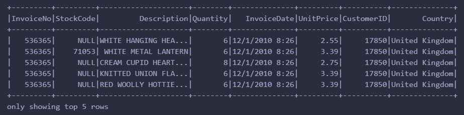
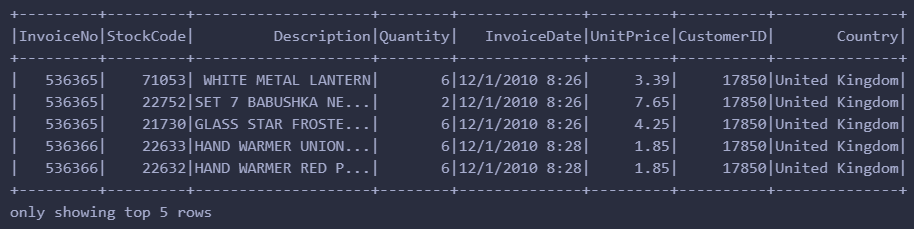
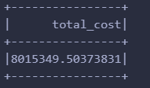
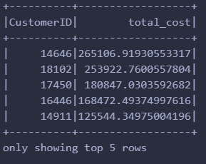
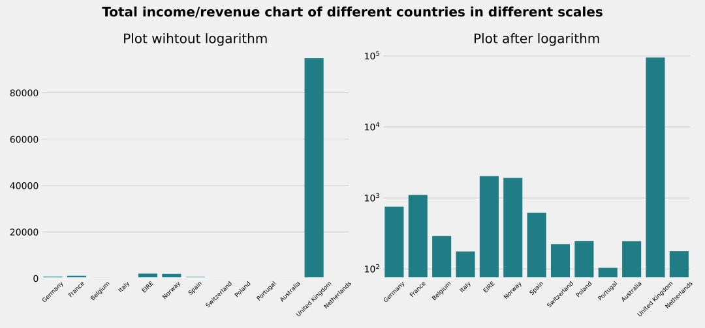
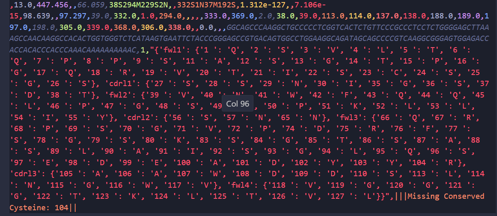
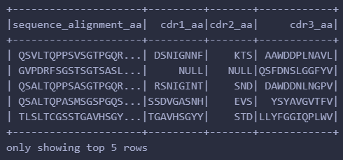
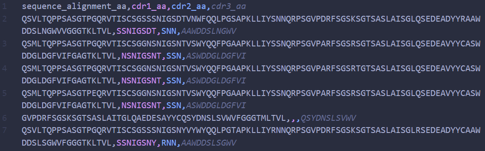
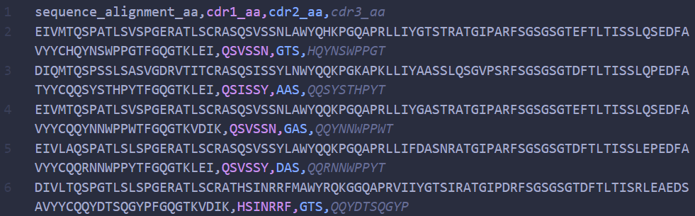

# STA323 Assignment1 report
---
SID: 12110821
Name: ZHANG Chi

## Solution for Q1
### (1)

There are 8 coliuns in the dataset, and the missing value is not allowed when the data is read in. There are total 541909 rows.

The schema of the dataset is defined as follows:

```python
schema = StructType([
	StructField("InvoiceNo", IntegerType(), False),     # 第三个：是否允许有空值
	StructField("StockCode", IntegerType(), False),
	StructField("Description", StringType(), False),
	StructField("Quantity", IntegerType(), False),
	StructField("InvoiceDate", StringType(), False),
	StructField("UnitPrice", FloatType(), False),
	StructField("CustomerID", IntegerType(), False),
	StructField("Country", StringType(), False)
])
df = spark.read.csv("./data/Q1_data/retail-dataset.csv", header=True, schema=schema)
```

The first 5 rows of the dataset are shown below:



After using `filter` to drop the records where their
`quantity` or `UnitPrice` is not positive, 363087 rows are left.

```python
df_clean = df.dropna().filter((col("Quantity") > 0) & (col("UnitPrice")> 0))
```


### (2)

The revenue is calculated by multiplying the `Quantity` and `UnitPrice` for each record, and then summing up the results.

```python
df_clean.select(expr("sum(UnitPrice * Quantity) as total_cost")).show()
```



### (3)

Before get top 5 customers that spend most, we need to calculate the total cost for each customer. Then we can sort the total cost in descending order.

Here I use `groupby` and agg to calculate the total cost for each customer, and then use `orderBy` to sort the result.

```python
df_clean.groupBy("CustomerID").agg(expr("sum(UnitPrice * Quantity) as total_cost")).select(col("CustomerID"),col("total_cost")).orderBy("total_cost",ascending = False).show(5)
```


### (4)

I use `to_timestamp` to convert the `InvoiceDate` to date type. After selecting (by `where`) the data during designated days, I use `groupBy` and `agg` to calculate the total cost for each day.

```python
# set the timeParserPolicy to LEGACY
spark.conf.set("spark.sql.legacy.timeParserPolicy", "LEGACY")
df_4 = df_clean.withColumn("InvoiceDate", to_timestamp(col("InvoiceDate"), "MM/dd/yyyy HH:mm"))
df_4.where("InvoiceDate between '2010-12-01' and '2010-12-05' ").groupBy("Country").agg(expr("sum(UnitPrice * Quantity) as total_cost ")).select(col("Country"),col("total_cost")).collect()
```
The bar plot drawed by `seaborn` is shown below. To make it clear, I also draw the plot in `log` scale.



## Solution for Q2
### (1)

I use `os.listdir` to get the list of all CSV files in the directory. Then I read the first CSV file to initialize the DataFrame, and use `union` to merge the rest of the CSV files. Observing that the first row of each CSV file features the double quote as it beginning, to remove it,  the `comment` option is used while loading `.csv` files.

```python
import os
csv_list = [p for p in os.listdir(path = "data/Q2_data") if p.endswith(".csv")]

# 读取第一个 CSV 文件来初始化 DataFrame
df = spark.read.format("csv").option("header","True").option("comment","\"").load(f"data/Q2_data/{csv_list[0]}")

# 从第二个文件开始，读取每一个 CSV 文件并进行合并
for i in csv_list[1:]:
    temp_df = spark.read.format("csv").option("header","True").option("comment","\"").load(f"data/Q2_data/{i}")
    df = df.union(temp_df)
```

> Before using `spark.read` to load files and remove first lines by `comment`, I tried to use `spark.read.text` and extract the lines by `df.tail()` (except first line) to `createDataFrame`. However, I can't find a easy way to split the each row to make the the number of result correpond to the number of columns as some values in one row is wrapped by `"{}"` with many commas(`,`) inside. The graphy is shown below. I can't split the row by a single comma.

So that the code below is not used in the final version.
`df = spark.read.text("data.csv")`
`col_name = (df.tail(2)[0]["value"]).split(",")`
`data = [df.tail(1)[0]["value"].split(",")]`
`df1 = spark.createDataFrame(data,col_name)`

Then filter the data to get the result.

```python
df.select(col("sequence_alignment_aa"),col("cdr1_aa"),col("cdr2_aa"),col("cdr3_aa")).where((length(col("cdr3_aa"))>=10) &  (length(col("cdr3_aa"))<=100 ))
df_remove.coalesce(1).write.format("csv").mode("overwrite").save("output/output_data/q2_pyspark.csv")
```



Save it to a single `.csv` file (Actually, it generatd 4 files in directory `q2_pyspark.csv`).

```python
df_remove.coalesce(1).write.format("csv").mode("overwrite").save("output/output_data/q2_pyspark.csv")
```


### (2)
Run the script by command `bash q2_2.sh` and the output file `q2(2)_sh.csv` is generated. There are 17157 rows (including column names) in the output file `q2(2)_sh.csv`.



### (3)
Run the script by command `bash q2_3.sh` and the output file `q2(3)_sh.csv` is generated. There are 17140 rows (including column names) in the output file `q2(3)_sh.csv`.

