# STA323 Assignment 2 report
---
SID: 12110821
Name: ZHANG Chi

## Solution for Q1
### (1)
As the header of each seqence is started with `>`, we can drop it by `filter` after reading the file by `spark.read.text`. 

```python
df1_1 = spark.read.text("data/Q1_data/protein.fasta")
df1_1 = df1_1.filter(~col("value").contains(">"))
```
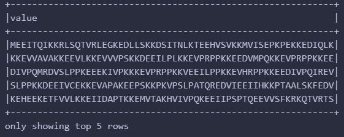

Then we can split each line by `split` and `explode` them to make every char (amino acid) in one line in the column `chars`. Finally, we can use `groupBy` and `count` to get the frequency of each word.

```python
df1_1_withchars = df1_1.withColumn("chars", explode(split(col("value"), "")))
df1_1_withchars.groupBy("chars").count().show(5)
```
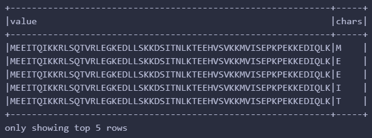

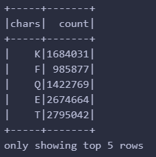

### (2)
Using RDD api, we can read the file and drop the header by `filter` and `map` the lines to characters. Then we can use `flatMap` to make every char in one line and use `countByValue` to get the frequency of each word.

```python
rdd1_2 = spark.sparkContext.textFile("data/Q1_data/protein.fasta")
rdd1_2 = rdd1_2.filter(lambda x: ">" not in x)
rdd1_2_withchars = rdd1_2.flatMap(lambda x: list(x))
total_count = rdd1_2_withchars.count()

frequencies = {k: v / total_count for k, v in counts.items()}
frequencies
```
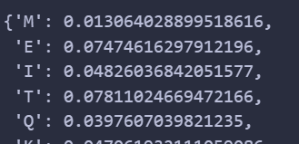

Besides, we can also use `reduceByKey` to get the count of each word, which could be more friendly to a low memory driver.

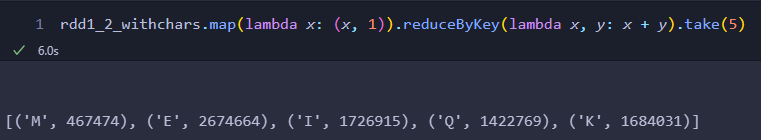

### (3)
To find the a specific sequence motif "STAT" (omitting the line break), we can use `re.findall` in `re` module to find all the matches in the every element of the rdd object `rdd1_2`. After that, we can use `filter` to drop the elements without any match and use `flatMap` to make every match in one line. Finally, we can use `count` to get the number of the matches.

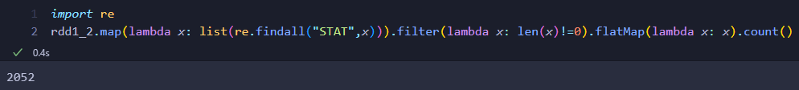

## Solution for Q2
### (1)

Firstly, read two `.csv` files by `spark.read.csv`, then rename some columns by `withColumnRenamed` as well as convert the data type of some columns if necessary according to the following questions.

```python
course = spark.read.csv("data/Q2_data/courses.csv",header=True)
course = course.withColumnRenamed("title","course_title")
course = course.withColumn("created",to_timestamp("created", "yyyy-MM-dd'T'HH:mm:ss'Z'"))
```

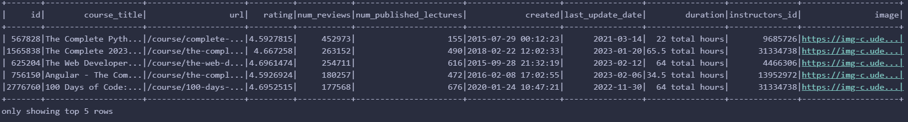

```python
instructors = spark.read.csv("data/Q2_data/instructors.csv",header=True)
instructors = instructors.withColumnRenamed("title","instructor_title")
```
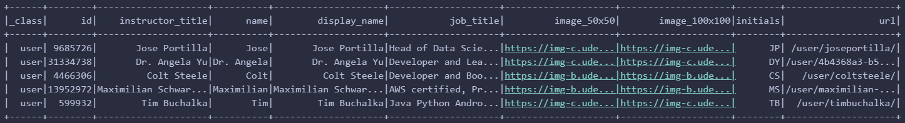

Then `join` them together (inner join) by columns `instructor_id` and `course_id`.

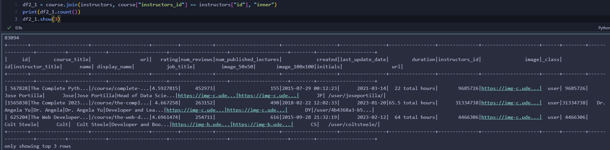


### (2)
Before selecting by `spark SQL`, a temporary view should be created by `createOrReplaceTempView`. 

Here is the detail about the SQL query referring to the requirements:

- **Highest course rating**: order the data by `rating` in descending order and select the first row.
- **Among all courses that are related to 'spark'**: use `like` in `where` to filter the rows that contain 'spark' in the column `course_title`.
- **Created after 2018-01-01 00:00:00**: select the rows that the column `created` is later than `2018-01-01 00:00:00` in `where`.

```python
df2_1.createOrReplaceTempView("df2_1")
spark.sql("select display_name, job_title from df2_1 where course_title like '%spark%' and created > '2018-01-01 00:00:00' order by rating desc LIMIT 1").show(truncate=False)
```

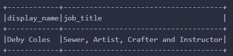

### (3)

Here is a brief explanation of the SQL query concerning the problem description:

- **All courses that are (a) related to 'interview'**: As `like` is case-insensitive, we can use `%interview%` to match any string that contains 'interview', which can also include 'interviews'.
- **Sorted by course_rating in descending order and created in descending order (newest first)**: order the data by `rating` in descending order and `created` in descending order.
- **Course rating should be firstly rounded to one decimal place**: use `round` to round the column `rating` to one decimal place.

```python
course.createOrReplaceTempView("course")
spark.sql("select course_title  as course,round(rating,1) as rating , created from course where course_title like '%interview%' order by rating desc, created desc").show(5,truncate=False)
```
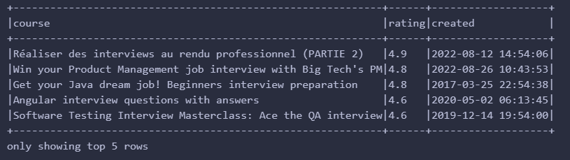