# STA323 Assignment 3 report

SID: 12110821
Name: ZHANG Chi

## Solution for Q1

In this question, we need to partition the data into four parts according to the value of column `origin`. In particular, the *Spark RDD API* should be used.

To begin with, I first read the data by `sparkContext.textFile()`, and show it to see the data structure (see picture below). We can find that the column names of each column in the dataset and from left to right are `date, delay, distance, origin,` and `destination`.

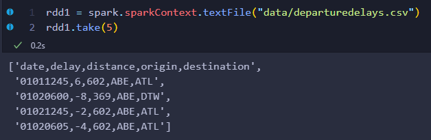

According to the requirement, we need to find the rows whose `origin` is `ATL`, which will be partitioned into one partition, and the rest will be partitioned into three others. Before achieving it, I use the `filter()` to drop the row having column names. Then my steps are as follows:

-  Use `keyBy()` and `lambda` to mark the value of the `origin` column as the key of each record: if it is `ATL`, the key is `1`. Otherwise, the key is `0`
-  Use `partitionBy()` to partition the data into four parts regarding to the key. The specific rule is that if the key is `1`, the record will be put into the first partition (return `0`). Otherwise, it will be put into other three partitions (return `random.randint(1, 3)`)

The result can be captured by the following code:

```python
partitioned_rdd = rdd2.partitionBy(4, partition_func)

# remove the key
partitioned_rdd = partitioned_rdd.map(lambda x: x[1])

# collect the result regarding each partition
partition_list = partitioned_rdd.glom().collect()
```

The number of elements of 4 partitions and some former elements are represented in sequence below.

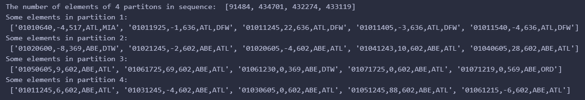

## Solution for Q2

### (1)

To set the number of partitions for streaming data in Spark, I use `spark.sql.shuffle.partitions` configuration property. This property determines the number of partitions used for shuffling data during operations like aggregations, joins, and sorting.

Since the `schema` needs to be specified when reading the streaming data, I first fetch the data schema by statistical analysis. The schema is shown in the following image after reading one randomly selected JSON file by `spark.read.json()`.

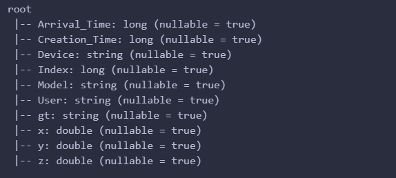

Noticing that both columns regarding time are in the format `long`, which is not a typical time type. Thus, I use `to_timestamp()` to convert the `timestamp` column `Arrival_Time` and column `Creation_Time`. However, the two columns are in the format of `long,` and the unit is not `s,` which will not present a satisfying result (the picture is shown below).

> This kind of long format will cause a`long type overflow` when defining a streaming query. 

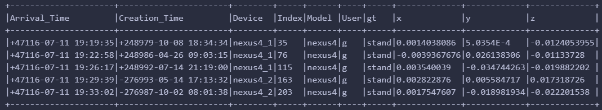

The solution can be found in [StackOverflow](https://stackoverflow.com/search?q=[apache-spark]stream+convert+timestamp), which divides the column by `1000000000` and `1000,` respectively, as their unit is `ns` and `ms`. The code is shown below.

```python
df.withColumn("Creation_Time",to_timestamp(col("Creation_Time")/1000000000))\
    .withColumn("Arrival_Time ",to_timestamp(col("Arrival_Time ")/1000))\
    .show(5,truncate=False)
```

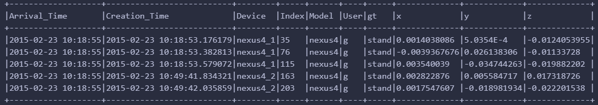

Then, we can define the streaming query by following the steps.

-   Read the streaming data by `spark.readStream.schema(schema).json()`. In addition, I also set the `maxFilesPerTrigger` to 10.
-   Defining the data operation: After converting the time datatype, a watermark can be set by `withWatermark()` to 1 minute. Then, use `groupBy()` to count records by the `user` and designate windows of 6 minutes moving forward in every 3 ( 6 - 3 = 3 ) minutes.
-   Specify the output. According to the requirement, here I use `update` mode as well as `memory` sink, and the checkpoint location can be set by `option("checkpointLocation", checkpointDir)`. Moreover, I also set the processing time to 2 seconds.

> It is puzzling that an error will be caused when rerunning the code, which asks me to delete the `offsets` directory in the `checkpoint` directory. After deleting the offsets directory by following the instructions, the error will not appear when rerunning the code. The exact reason is not apparent to me.
>
> 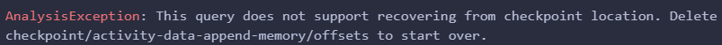
>
>```python
> import os 
> import shutil  
> if os.path.exists('checkpoint/activity-data/offsets'): 
>     shutil.rmtree('checkpoint/activity-data/offsets')     # 强制删除文件夹
>```

The first three query results are shown below. Each query will show ten rows, and all rows will be sorted by `window` in descending order to emphasize data streaming. Besides, the interval between two queries is 2 seconds by `time.sleep(2)`.

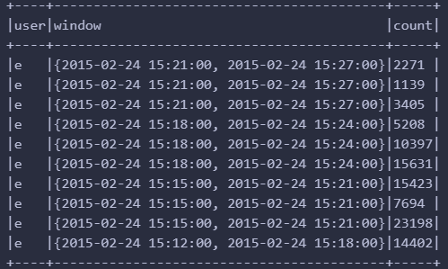

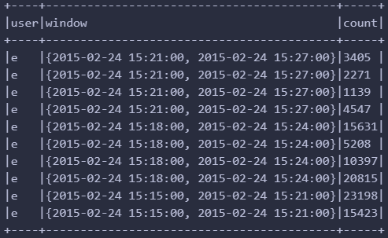

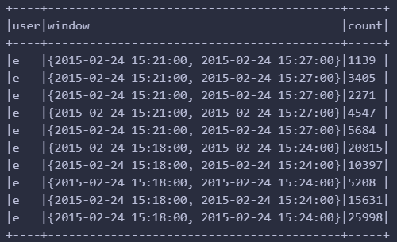

### (2)

In this part, I need to define two queries simultaneously under the task in Q2.1, meaning that I only need to modify the code’s last part (output and sink).

The two queries are both in `append` mode but with different output sinks. The first query is to write the result to the `memory`, while the second is to write the result to the `parquet` sink. The code is shown below. Notably, the checkpoint location, as well as instructions to remove the offsets directory, should be set for each query.  

```python
parquetOutputPath = "output/activity-data"
activityQuery2 = activityCounts.writeStream \
    .queryName("activity_query2")\
    .format("parquet") \
    .outputMode("append") \
    .option("checkpointLocation", "checkpoint/activity-data-append-parquet") \
    .option("path", parquetOutputPath) \
    .start()

activityQuery3 = activityCounts.writeStream \
    .queryName("activity_query3")\
    .format("memory") \
    .outputMode("append") \
    .option("checkpointLocation", "checkpoint/activity-data-append-memory") \
    .start()
```

## Solution for Q3

The data file the question gives consists of users’ online shopping records. If the data is stored correctly, the `action` column should have four kinds of integer values from 1 to 4, and the `gender` column should have two kinds of integer values, 0 and 1.

### (1)

Before creating a Kafka pipeline, I would like to check the data structure using `spark.read.csv()`. Unfortunately, some values are not expected in the `gender ` column (see the picture below). The reason is not clear so that we can filter the data by the rule `(col("gender") != 0) & (col("gender") != 1)` tentatively.

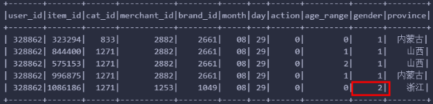

Then, we can create a Kafka pipeline step by step. 

First, in the shell script `ass3_q3_kafka.sh`, I start the ZooKeeper service by running the `ZooKeeper-server-start.sh` script. ZooKeeper is a distributed coordination system for managing configuration information and the status of Kafka clusters. Next, the Kafka service is run by the `Kafka-server-start.sh` script. Finally, the Python script `ass3_q3_runproducer.py` is called. This producer reads the contents of the given CSV file and sends it as a message to a specific topic `q3` in the Kafka cluster. 

More specifically, I use the `pandas` library to read the whole file and then iterate over each row to send it out by a `KafkaProducer` object, which was defined before. As the question asks that messages should contain the `action` and `gender` columns, I define a dictionary `{"action": row["action"], "gender": row["gender"]}` additionally. Then, the `KafkaProducer` will serialize the dictionary by `json.dumps()` before sending it out, and the message will be sent every 0.5s because of `time.sleep(0.5)`.

To check the data in the topic `q3`, I use the `KafkaConsumer` object to subscribe to the topic `q3` and print the message in the Python script `ass3_q3_runconsumer.py`. The result is shown below.

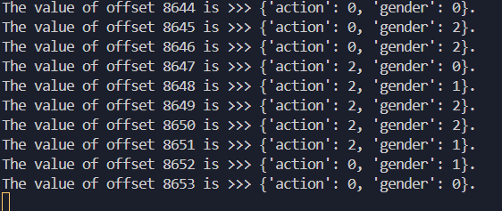

Then, I can define the streaming query by reading the data from the topic `q3`. All messages are stored in the column `value `. The schema is shown below, from which we can find that the column `value ` is binary and the column `timestamp ` is integer. Hence, the datatype should be converted first.

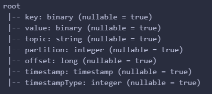

For the field `value`, I convert it to a string by `cast()` and then use `from_json()` to parse the string into a struct type. The schema of the struct type is defined in the `schema,` which is shown below. Then, I can extract the `action` and `gender` by `data.action` and `data.gender`,  respectively. For the field `timestamp`, I convert it to a timestamp by `CAST (timestamp AS TIMESTAMP)` directly.

```python
df1 = df.selectExpr("CAST(key AS STRING)", "CAST(value AS STRING)", "CAST (timestamp AS TIMESTAMP)")
schema = "gender INT, action INT"
df2 = df1.selectExpr("key", "from_json(value, '{}') AS data".format(schema), "timestamp")
```

The `where()` is used to filter the data. Except for the value of `action`, which should be two required by the question, the value of `gender` should be 0 or 1. In order to count the number of male and female records, I use `groupBy()` to count the number of records by `gender`. Both the watermark and window are set to 10 seconds and 5 seconds, respectively. Furthermore, the output is set to the `memory ` sink in `complete` mode.

```python
df_filter = df2.where((col("data.action") == 2) & (col("data.gender") != 0) & (col("data.gender") != 1))
result = df_filter.withWatermark("timestamp", "10 seconds").groupBy("data.gender",window("timestamp", "5 seconds")).agg(count("*").alias("Number of transactions"))
q3_query = result.writeStream.queryName("transaction_count").format("memory").outputMode("update").trigger(processingTime="5 seconds").start()
```

The first 20 rows are displayed below.

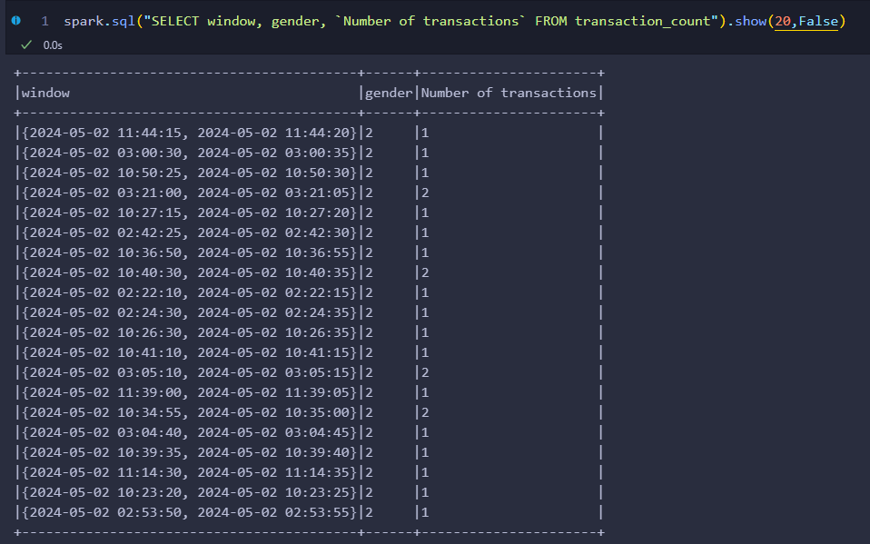

### (2)

Kafka uses a log-based storage mechanism to handle messages. The log is organized into topics and partitions. Messages are stored in log files, with each file containing a sequence of log entries. Each log entry consists of a message length and the message itself.

Here is a brief overview of how Kafka handles logging. I scratched it from the [Kafka documentation](https://kafka.apache.org/documentation/#log).

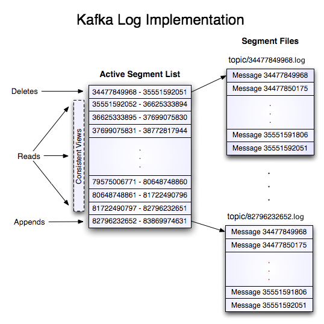

**Writing** to the log involves serial appends to the last file, which is rolled over when it reaches a certain size. Kafka provides durability guarantees by flushing messages to disk after a configurable number of messages or time intervals.

**Reading** from the log is done by providing the offset of a message, and Kafka returns the messages starting from that offset. If a message is larger than the buffer size, the read can be retried with a larger buffer.

Log segments are **deleted** based on time and size policies. The log manager deletes the oldest segments until the partition's size is within the configured limit.

Kafka ensures data integrity by verifying the validity of log entries during startup. Corruption detection handles truncation and corruption scenarios, and the log is truncated to the last valid offset if corruption is detected.

In a nutshell, the logging mechanism in Kafka provides fault tolerance, scalability, and efficient data storage and retrieval. It enables high-throughput message processing and reliable data replication across multiple brokers.