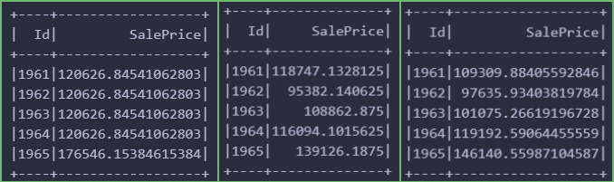

# STA323 Assignment 3 report

SID: 12110821
Name: ZHANG Chi

## Solution for Q1

In this question, we need to train 3 models (decision tree, XGBoost and LightGBM) in the same dataset and tune their hyperparameters for better performance in the validation data, which account for 20% of the original training data (train.csv). Then we should write the prediction results of the test data to the corresponding files.

### Data Preprocessing

Firstly, the variables should be classified into two types: numerical and categorical. The numerical columns are those with the datatype `Double` and the categorical columns are those with the datatype `String`. For simplicity, I select some numerical columns manually and use the rest of the columns as the categorical columns. Additionally, as `id` is the identifier of the record by order, which will not include much information for fitting, so that I scrap `id` in the numerical columns. 

Secondly, we need to check the missing values in the dataset. To begin with it, I filter some missing values in the numerical columns, then convert them to the `Double` datatype through following codes.

``` python
for col_name in numericalCols:
    train = train.where(col(col_name) != "NA").withColumn(col_name, col(col_name).cast(DoubleType()))
```

However, this method will make the dataframe be a empty table which will cause an error `empty collection` when fitting models. The reason is that some fields in the for loop is not the string type, causing a mismatch when comparing with the string `"NA"`, which will return `False` uniformly in spark. To address this problem, the `NA` should be converted to the real missing value `None` firstly. Then we can feel free to filter the rows with missing values. And there are 265 records with missing values have been removed in the training data.

At last, before the data was inputted in the model, we need to convert the categorical columns to the numerical columns, which is efficient for model to train. The `StringIndexer()` can be used at first. Then a `VectorAssembler()` can be used to combine all the features into a single vector. Besides, I use the `VectorIndexed()` to convert the latent variables with less level to be the categorical variables. The specific code is as follows.

``` python
indexOutputCols = [x+"Index" for x in categoricalCols]
categoricallIndexer = StringIndexer(inputCols=categoricalCols, outputCols=indexOutputCols, handleInvalid="skip")
assembler = VectorAssembler(inputCols=numericalCols+indexOutputCols, outputCol="rawFeatures")
featureIndexer = VectorIndexer(inputCol="rawFeatures", outputCol="indexedFeatures", maxCategories=8)
```

### Train models

For each model, I use the same structure by for training, tuning and predicting. The structure is as follows:

- Define a `parmaGrid `and `TrainValidationSplit()` estimator. The `TrainValidationSplit()` will split the training data into training (80%) and validation (20%) data with `TrainRatio` being 0.8. The evaluator used in the `TrainValidationSplit()` is `RegressionEvaluator()` with the metric being `rmse`.
- Define a pipeline consisting of the data preprocess and `TrainValidationSplit()`.
- Fit the pipeline with the training data, then test the best model directly with the test data as well as output the result to the corresponding `.csv` file.

The first model is the decision tree regressor. The hyperparameters of the decision tree are `maxDepth` ,`minInstancesPerNode`, and `maxBins`. 

> The `maxDepth` is the maximum depth of the tree and the `maxBins` is the maximum number of bins that the decision tree can split.  The `minInstancesperNode` is the minimum number of instances each child must have after a split.
> The three parameters are searched for the best combination in the grid of `maxDepth` = [5, 10, 15], `minInstancesPerNode` = [1, 2, 4], and `maxBins` = [128, 256, 512].

The second model is the XGBoost regressor, which i s a gradient boosting algorithm with depth-wise growing the tree. The hyperparameters of the XGBoost are `max_depth` and `max_bin`.

The third model is the LightGBM regressor, which is also a gradient boosting algorithm, but growing the tree in leaf-wise (make it faster than the former). The hyperparameters of the LightGBM are `maxDepth` and `maxBin`.

### Results

The results of the three models are presented in the following image. Form left to right is the decision tree, XGBoost and LightGBM.



## Solution for Q2

The data given by the question is about orders with different customers in the store, from which we can analyze the the habit and behaviors of distinct groups of customers. 

### Data Preprocessing

Firstly, there are 541909 records in the whole data with 8 fields, including two numerical fields `UnitPrice`, `Quantity`. In this question, I will use these two features as my main features when clustering the customers.

Then the missing values should be checked. Inspecting the table, we can find that there are two columns (`Description` and `CustomerID`) having missing values. Even though there are more than 20% samples with missing values, there is no need to drop them as the numerical columns are not impacted by them.


Before we conduct the clustering, we need to check the distribution of numerical fields to identify any suspicious outliers. Then the `summary` is used to show the descriptive statistics of the numerical fields.


According to the figure above, there are negative numbers in `Quantity` and `UnitPrice`, which are not reasonable. We need to check them.


From the table above, we can see that there are 9288 canceled orders, 10624 orders with quantity less than 0, and 2 orders with unit price less than 0. The preliminary judgment is that the negative values are caused by the cancellation of orders. But the number of negative values in `UnitPrice` are in large gap between number of quantity(<0), which is not reasonable. **For these orders, I will drop the rows with negative values in `UnitPrice` but keep the rows with negative values in `Quantity` as they contain the information of the cancellation of orders.**

However, there are still some values are much lesser or larger than the others, which may be outliers. For instance, the 75% quantile of `Quantity` is 10, but the maximum is 80995. A further check is needed and tables below showing some records sorting by `Quantity` or `UnitPrice` in descending order, respectively. 


For the first table, we can see that the top 2 value of `Quantity` is 80995 and 74215, which are much larger than the others. So that we can remove them by 1.5 IQR criteria. And the filtering data's summary statistics are shown below, which have only 444108 samples.


### Q1 - Clustering

Before clustering, we need to normalize the data. The `StandardScaler()` is used to normalize the data by removing the mean as well as scaling in standard deviation. Then we can use the `KMeans` to cluster the data. The `KMeans` is a partitioning clustering algorithm, which can be used to cluster the data into `k` clusters. 

The `KMeans` is used to cluster the data into k (a hyperparameter) clusters in this question. The `KMeans` is trained with the normalized data and the `transform()` is used to predict the cluster of each record. The `transform()` will return a new column `prediction` which is the cluster of each record.

To find the best `k`, the `KMeans` is trained with different `k` and the `trainingCost` as well as `silhouette` score is calculated.  The `maxIter` I set is 50, and `seed` is set to 42.

> In K-means clustering, trainingCost usually refers to the sum of the Euclidean distances from all data points to the center of the cluster to which they belong, also known as WCSS (Within-Cluster Sum of Square). However, it's not mean that the smaller the value, the better the clustering effect. Because trainingCost continues to decrease as the number of clusters increases, even when each data point is a cluster, trainingCost drops to zero. 
> Hence Silhouette coefficient can be used as an index to evaluate clustering effect, which considers both cohesion and separation of clustering.  The contour coefficient is calculated by $\frac{b - a}{max(a, b)}$. where a is the average distance of one sampled point from all other points in the same cluster, b is the smallest value of all the average distance between the sampled point and all points in the other clusters, which represents the degree of separation. This coefficient has a value between-1 and 1. The more close to 1, the better the clustering effect.

The following figure illustrates the silhouette score and training cost of different `k`. The highest point of right figure of silhouette score is suggesting a best `k` of 3. And the clustering scatter plot is also shown below. With x-axis being `Quantity` as well as y-axis being `UnitPrice`, the visual object depicts a great partition of the data into 3 clusters.


### Q2 - tSNE

Except for the scatter plot of clustering, we can also use the tSNE to visualize the data in 2D. The tSNE is a nonlinear dimensionality reduction algorithm, which can be used to reduce the dimension of the data to 2D or 3D. In this part, I will use `TSNE()` provided by `sklearn.manifold`. The tSNE is trained with the normalized data and the `fit_transform()` is used to predict the 2D data.


### Q3 - Analysis


The summary statistics are shown above for each cluster. The cluster 0 has the largest average `Quantity` but the smallest `UnitPrice`, which means that the customers in this cluster are more likely to buy more low-priced goods. Perhaps they are the customer that sensitive to prices, who are willing to purchase the discounted commodity. The cluster 1 has the smallest average `Quantity` but the largest `UnitPrice`, which means that the customers in this cluster are more likely to buy less and expensive products. They may the customers that considerate to each order. Compared with the other two clusters, the cluster 2 has the biggest number of people. They are prone to buy the products with smallest `Quantity` and `UnitPrice` on average. They may be the customers that have a stable consumption habit.

