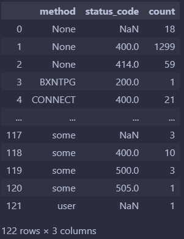

# STA323 Project 1 report
---
SID: 12110821
Name: ZHANG Chi

## Solution for Q1

The data given is about an an existing network infrastructure, which is stored in multiple directories.

### (1)

Before we read the whole data, we need to know the structure of the data. I use `spark.read.text` to read one `http.log.gz` of the first directory, and we can find that each record is in `json` format. So we can use `spark.read.json` to read the data.


Given a path list, the function can also read the data from the each path from path list and concat them together to a single dataframe.

```python
folders = ["00", "01", "02", "03", "04", "05"]
df_http = spark.read.json([f"data/maccdc-2012/{folder}/http.log.gz" for folder in folders])
df_dns = spark.read.json([f"data/maccdc-2012/{folder}/dns.log.gz" for folder in folders])
```

After checking the column `ts`, we can feel free to convert it to a `Timestamp` data type by `to_timestamp` with `withColumn` function. And the temp view is created for further analysis.

```python
df_http = df_http.withColumn("ts", to_timestamp(col("ts")))
df_dns = df_dns.withColumn("ts", to_timestamp(col("ts")))
df_http.createOrReplaceTempView("http_log")
df_dns.createOrReplaceTempView("dns_log")
```


### (2)

In this task, we need to find the top uri that has been accessed most among the records whose `uid` is `status_code` is 200 and `method` used is `GET`. 

We can use `filter` to filter the records and then group by the `uri` and count the records. Finally, we can sort the result by the count in descending order and show the top records. The code is as follows:

```python
# In Spark SQL API
spark.sql("SELECT uri, COUNT(uri) AS uri_count FROM http_log WHERE status_code = 200 AND method = 'GET' GROUP BY uri order by uri_count desc").show(5)

# In Spark DataFrame API
df_http.select(col("uri")).filter((col("status_code")==200) & (col("method")=='GET')).groupBy(col("uri")).agg(count(col("uri")).alias("uri_count")).orderBy(col("uri_count").desc()).show(5)
```

And they get the same result:


### (3)

After inner joining two tables by `uid`, filtering the records in the same way as in the last task, the number of record whose `proto` is`tcp` for each `uri` can be calulated by `SUM(CASE when proto='tcp' THEN 1 ELSE 0 END) Group By uri`. Then results are sorted by the  `tcp_ratio` in descending order and top records are showed below.


### (4)

According to the requirement, we need to calculate the use frequency of each method. Then `groupBy` and `agg` can be used directly. The result are showing below:


To get the number of records in different status code for each method, two columns have been put into `GroupBy`.  Before we plot the pie chart, we need to convert the result to a pandas dataframe.



It is notable that some values in column `method` and column `status_code` are missing. And I will drop `None` but keep `NaN` as we want to get distribution of status code regarding to a specific method. Besides, the method emerging once (only appearing with one kind of status code) will also be scrapped, and selected methods are shown below.


Then we can use `matplotlib` to plot the pie chart. 


## Solution for Q2

### (1)

To scratch the data, I use `request` to get the data from the given website and use `BeautifulSoup` to parse the data. In the main page, there is a list of links to the detailed information of each article. I used `find_all` to get a link list and then request the page related to each link to get the article. Here is a shortcut of the website structure.


Then there is a `for` loop to get the data from each page. In each paragraph of one article in a page, texts are seperated into multiple lines under unknown resons. In this case, I first convert the soup object into a string, replace `'\n'` into `""` and split the string by `<br/><br/>`, which is a kind of paragraph seperator in html. Now each sentence has been grouped into their own paragraph. However, there are also some annoying html tags in the text. I use regular expression to remove them.

Besides, I also replace some special characters in the title of the article to avoid the error of reading files by `spark.sparkContext.textFile`.

```python
for i in tqdm(article_list):
    try:
        href = i['href']
        if "http" in href:
            article_page = requests.get(href)
            split_text = re.split('\n{2,}', article_page.text)
            text = ("\n").join([i.replace("\n", " ").strip("-").strip() for i in split_text if i != ""]).strip("\n")
        else:
            article_page = requests.get(f"{suburl}{href}")
            article_soup = BeautifulSoup(article_page.text, 'html.parser')
            article_text = article_soup.find("font", face = "verdana")
            para_list = str(article_text).replace("\n", " ").split("<br/><br/>")
            text = ("\n").join([re.sub('<.*?>', '', i).strip() for i in para_list if i != ""]).strip("\n")
            
        txt_file = i.text.replace("/", "or").replace("?", "").replace(",","").replace(":", "")
        
        with open(f"data/paul_articles/{txt_file}.txt", "w") as f:
            f.write(text)
    except Exception as e:
        print(f"Error with {i.text}: {e}")
        continue
```

> Two url links are not in the format of previous links, and even their related pages are not consistent with others. I use a `if` statement to deal with them separately. 
>
> 
>
> Same as the previous step, `\n` and `\n+` (more `\n` like `\n\n`, `\n\n\n`) are used simultaneously in one page. Luckily, I find that `\n+` is used to seperate paragraphs. So I use `re.split` by `\n+` to split the whole page. Then I can let every paragraph to be a single line.
>
> 

### (2)

In this task, the main problem is to get key phrases in high quality. To finish it, I ask `chatgpt` for help, and my prompts as well as corresponding reponses are as follows:

> In my Pyspark task, I have a rdd that contains texts (each element is a paragraph) written by a author. Now I want to find paragraphs talking about 'career planning', could you help me find some key phrases from raw contents which I will give you to help me filter elemetns in rdd? If Ok I will give you the raw contents. And you will give me the key phrases.
>
> 
>
> 

The raw pages I give the gpt are "Ideas for Startups", "Web 2.0", "Why TV lost" and so on. Sometimes it can give me the key phrases directly, and sometimes it can find that the raw contents are not related to the career. Including phrases Induced by my self or by online information, I summarize all these phrases (listed in Appendix A) into the `phrases_list` and use them to filter the paragraphs in the rdd. 

There are ways I think can be used:

- For each phrase in the `phrases_list`, I will tokenize it to a small phrase_tuple. If one paragraph contains all words of any phrase_tuple (even in disorder or in different morphologys), I will consider it as a paragraph talking about career planning, which will be kept in the final result.
- Let all tokens in the paragraph be the nodes of a graph, and the edges are the co-occurrence of two words in the same paragraph. Then I will use a graph algorithm to find the subgraph that contains all nodes in the phrase. If the subgraph is connected, the paragraph is considered to be talking about career planning.

> Word tenses and case should be ignored because authors may use different tenses and case to convey the same meaning. So I will convert words into lower cases as well as normalize each of them. What I used to normalize words is deleting letters. For example, If `coming` is converted to `come`, then `coming` may not be pointed out, so I use `com` to represent `coming`. But this may relate to some unwanted words like `common`. In my opinion, more is better then less.

Taking the complexity and time efficiency into account, I use the first way to filter the paragraphs. Here is a shortcut of the selected paragraphs.


To save the result into a `parquet` file, I first convert the rdd into a dataframe and then save it.

```python
spark.createDataFrame(career_suggestion.map(lambda x: Row(text=x))).write.format("parquet").mode("overwrite").save("output/career_suggestion.parquet")
```

> To save the file successfully, we need set the configure of the spark session at its creation to avoid the error of exceeds of heap memory (shown below). Here my configuration are `("spark.executor.memory", "8g")`and `("spark.driver.memory", "8g")`
>
> 

### (3)
In order to extract noun phrases from the paragraphs, referring to the `Spacy` given by the question, I define a `UDF` function called `extract_noun_phrases`, which can extract noun phrases by model `en_core_web_sm`.

```python
nlp = spacy.load("en_core_web_sm")

def extract_noun_phrases(text):
    doc = nlp(text)
    noun_phrases = [chunk.text for chunk in doc.noun_chunks]
    return noun_phrases

spark.udf.register("extract_noun_phrases", extract_noun_phrases, ArrayType(StringType())) 
```

After registering the `UDF`, I can use it in `flatMap` and get all noun phrases in one rdd. Then `CountByValue` and `sorted` by the count can be used to get top 40~50 noun phrases.


Then the word cloud map can be plotted by `wordcloud`. As the parameter `max_words` exceeds the total number of words, the `repeat` is set to `True`.


However, the plot generated by `wordcloud` is not that satifying. So I use `stylecloud` to plot the word cloud map, which is an advanced encapsulation API of `wordcloud`. The result is shown below.


> In fact, the api has some bugs, because it has not been maintained for many years, so I jump directly to his api source code and change it.
> - if encountering an error that `'ImageDraw' object has no attribute 'textsize'`, that is because `ImageDraw.textsize()` called by it has been updated, and two places are needed to be changed in the source code, which is shown in the figure below (ref: [python - 'ImageDraw' object has no attribute 'textbbox' - Stack Overflow](https://stackoverflow.com/questions/76189891/imagedraw-object-has-no-attribute-textbbox))
>
> 
>
> - If there are not enough words in the list, you want to repeat them when plotting. Just modify the `repeat` parameter in the source code, as it call the `wordcloud` function in the `wordcloud` package. 
>
> 

## Appendix

### A

All key phrases I used to match the paragraphy talking about career planning are as follows:

```python
phrases_list = [
   "Career plan",
   "suggestion for",
   "suggestion of",
   "suggestion about",
   "Career development",
    "Skill development",
    "Career goal",
    "Job market",
    "Career mentor",
    "Career counsel",
    "Career transition",
    "Self-assessment",
    "Career prospect",
    "Industry research",
    "Resume and cover letter",
    "Interview preparation",
    "Professional networking",
    "Continuing education",
    "Job satisfaction",
    "Work life balance",
    "Career success",
    "Professional ethic",
    "Career growth"
    "Find startup",
    "Generat startup",
    "Com up zip_with",
    "Value of initial",
    "Start point",
    "Partial solution",
    "Max future option",
    "Work on new technolog",
    "Conversation with friend",
    "University research startup",
    "Importance of collaboration and friendship",
   "Mind wander and idea generation",
    "Mak thing eas to use",
   "Mak something people want",
    "Redefin problem",
    "Mak thing cheaper and commoditiz",
   "Mak thing easier",
   "Design for exit strateg",
   "Product development on spec",
   "Counteract monopol",
   "Accident startup",
   "Do what hacker enjoy"
]
```

