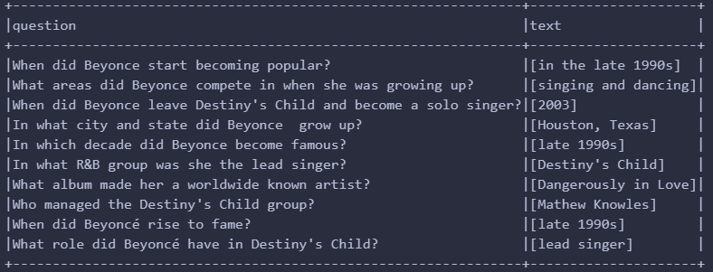
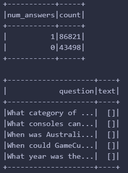
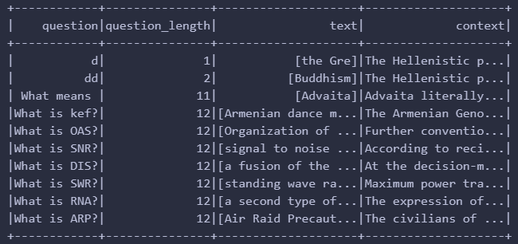
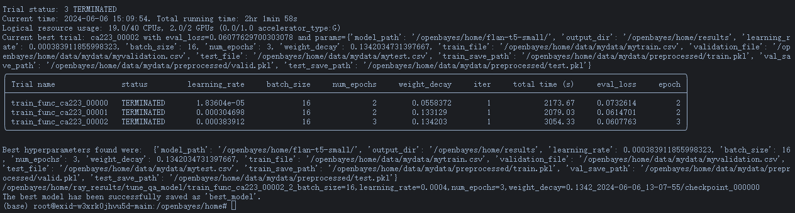
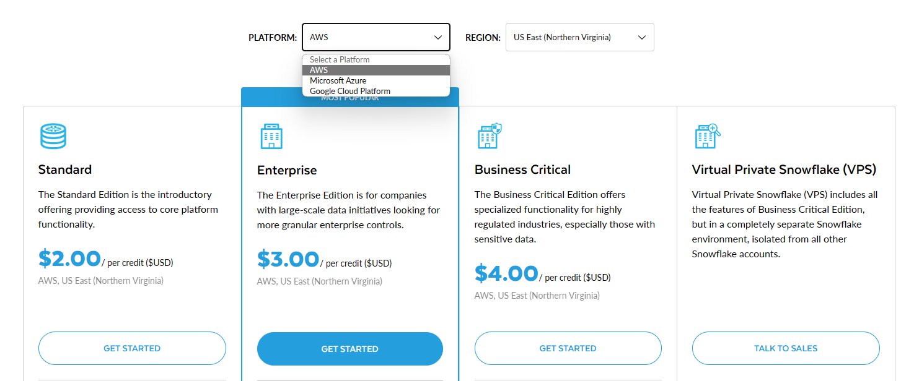
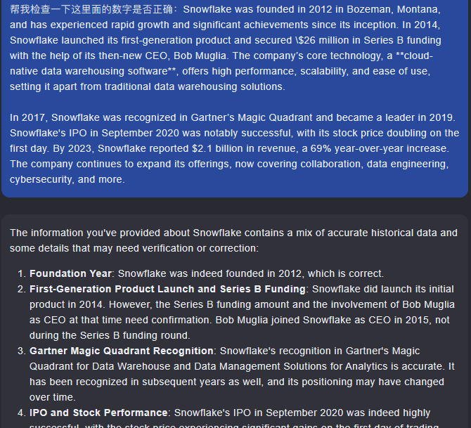
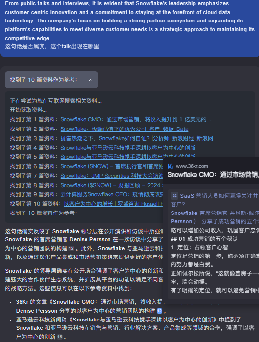

# STA323 Project 2 report

SID: 12110821
Name: ZHANG Chi

## Question and answering system

In this assignment, we need to build a Question-Answering System based on the provided dataset and the model by fine-tunning. The dataset `squad_v2` is a collection of questions and answers, and the answer for each question is intercepted from the context that given with the question.

### (1)

After loading data by `spark.read.format("parquet").load()`, the schema should be checked first, as we only need columns regarding input and output. The schema of the dataset is shown below:

```python
root
 |-- id: string (nullable = true)
 |-- title: string (nullable = true)
 |-- context: string (nullable = true)
 |-- question: string (nullable = true)
 |-- answers: struct (nullable = true)
 |    |-- text: array (nullable = true)
 |    |    |-- element: string (containsNull = true)
 |    |-- answer_start: array (nullable = true)
 |    |    |-- element: integer (containsNull = true)
```

According to the informaton of dataset provided by hugging face, the `answers` column is a struct column that contains two array columns: `text` and `answer_start`. The `text` column contains the answer to the question, and the `answer_start` column contains the starting position of the answer in the context. The `context` column contains the context of the question, and the `question` column contains the question. The `id` column is the unique identifier of the question. Here is a shortcut of the top 10 rows, with column `question` and `text`.




Before we convert them into standard inputs and outputs, I'd like to inspect how many unanswerable questions it contains, so that `size(column)` and `groupby().count()` are used. Besides, some records having missing answers text also show below.



To explore more of data, I print the length of question in ascending order, from which we could find two questions with only letter `d` are unreasonable. Hence, I will drop them in the next step. Here is shortcut of records printed by me.



Based on the data format required in the papaer `T5`, there are two columns `input` and `output` should be saved, where `input` contains both the column `question` and `context` with format `question: xxxx context: xxxx`. To concat these two fields, I use `concat()` in `withColumn()`, and the `lit("")` is necessary to add texts "question" and "context" to the string. Hence the final code is `df = df.withColumn("input", concat(lit("question: "), col("question"), lit(" context: "), col("context")))`

After preprocessing, we also need to split the training data into training set and validation set, where the number of records should be 5000 for validation set roundly. However, `randomsample()` can not designate the specific number of samples to be selected. Also, `sample()` is not used as it can not promise to choose the number we give. Therefore, to select 5000 samples exactly, `shuffle()` can be used to shuffle the data, then we can select the first 5000 samples freely. The concrete code is as follows:

```python
training_filter = training_filter.orderBy(rand(seed = 42))
training_filter.cache()
validation  = training_filter.limit(5000)
train = training_filter.exceptAll(validation)

print(train.count())   # 125317
print(validation.count())  # 5000
```
### (2)

This report outlines the process and framework used to fine-tune the Flan-T5-small model for a Question Answering (QA) task using Ray-tune for hyperparameter tuning. The whole training was performed on **openbayes with RTX4090*2**, after debugging in the course server with only CPU (using additional training and validation datasets with only 20 samples).

The training framework is divided into several key components:

-   Data Reading and Preprocessing: The whole process is wrapped in the function `load_and_preprocess_datasets()`, consisting of reading data by `load_dataset()`, tokenize the input and output text for the model in the function `preprocess_function`, and save the preprocessed data by `pickle`. To ensure that the sequences are padded and truncated to the specified lengths, parameters are set to `True`. Referring to the training examples in the huggingface repository, the `max_length` is set to 384, 30 for questions and outputs, respectively.

    ```python
        # Tokenize inputs
        model_inputs = mytokenizer(inputs, max_length=384, padding= True, truncation=True,return_tensors="pt")
        # Tokenize targets
        labels = mytokenizer(targets, max_length=30,padding = True,truncation=True,return_tensors="pt")
        # Add labels to model inputs
        model_inputs['labels'] = labels['input_ids']
    ```
    What's more, I also define a logic that checking if there are preprocessed datasets existing and the `pickle` data can be loaded directly if true, otherwise the programme will process it and save to the designated directory passed in `config`.

-   Training Setup: Define a function `train_func()` that calls `load_and_preprocess_datasets()`, loads the model and tokenizer, sets up training arguments, and trains the model. This function will be used by Ray Tune for hyperparameter tuning. 
    -   To initial tokenizer and model, I use `T5Tokenizer.from_pretraine()` and `T5ForConditionalGeneration.from_pretrained()`. Here is a pitfall that the tokenizer loaded by `AutoTokenizer.from_pretrained()` will not be saved successfully after whole training, causing a big trouble for the third question as the file `spiece.model` does not exist. 
    -   Then the `Seq2SeqTrainingArguments` class from the Huggingface library is used to configure various training parameters. The `Seq2SeqTrainer` class handles the training loop, evaluation, and saving of the model.
    -   To evaluate the model, calling the `evaluate()` method of `Seq2SeqTrainer` to assess the model's performance on the validation dataset. This method returns a dictionary containing evaluation metrics, and the validation loss (`eval_loss`) is gotten from the evaluation results, which is a crucial metric for assessing model performance. Besides, If `val_loss` is None, an error is raised to indicate that the evaluation results did not contain `eval_loss`. This ensures that the evaluation was successful and a valid loss value was obtained. Using Ray's `session.report()` method to report evaluation metrics and checkpoints.

-   Hyperparameter Tuning with Ray: The `tune_transformer` function is designed to perform hyperparameter tuning for a transformer-based model using Ray Tune. The function defines the configuration for the tuning process, sets up a scheduler, and reports the results of the tuning trials. Finally, it identifies and saves the best model based on the evaluation loss. The `tune_run()` is the most important function, containing the whole tunning processes by calling `train_func` for each trial. The `tune.with_parameters(train_func)` specifies the training function used for each trial, while `metric="eval_loss"` and `mode="min"` indicate that the evaluation loss is the metric to be minimized. The `resources_per_trial={"cpu": 19, "gpu": 2}` allocates 19 CPUs and 2 GPUs per trial, which can be adjusted as needed. The `config=tune_config` passes the predefined tuning configuration. The `num_samples=3` sets the number of trials to be conducted. The `storage_path=args.local_dir` specifies the local directory to store tuning results. Finally, `keep_checkpoints_num=3` limits the number of checkpoints saved during the tuning process. The following is a summary of the hyperparameters tuned by ray and the location of the best model saved.

	

To run the all above tunning process, the python script is started by parsing command-line arguments to configure various paths and parameters needed for training and evaluation. The `argparse` library is used to define and parse command-line arguments. The `parser.add_argument()` method is used to define the arguments, and the `parser.parse_args()` method is used to parse the arguments. Then in the bash script, the workdir variable is set to store the current working directory as absolute directory is needed in ray for successful running.

```bash
python Q1_2.py --model_path ${model_path} --train_file $train_file --validation_file $validation_file --test_file $test_file --output_dir $output_dir --bestmodel_dir $best_model_dir --local_dir $local_dir --traindata_process_save_path $traindata_process_save_path --valdata_process_save_path $validationdata_process_save_path --testdata_process_save_path $testdata_process_save_path
```


### (3)

To deploy the QA model with Spark-NLP, we need to transform the current hugging face model to the spark-nlp model. More specifically, I use the tool `onnx`. 

```python
!optimum-cli export onnx --task text2text-generation-with-past --model {MODEL_NAME} {EXPORT_PATH}
```

-   `optimum-cli` is the command-line interface for the Optimum library, which is a tool designed to optimize and accelerate machine learning models. 

-   `export onnx` specifies the action to export the model to the ONNX format. ONNX is an open format designed to represent machine learning models. ONNX models can be run on different platforms and hardware accelerators.

-   `--task text2text-generation-with-past` specifies the type of task the model is used for, in this case, text-to-text generation with past key values.

-   `--model {MODEL_NAME} {EXPORT_PATH}` specifies the model to be exported and the path to save the exported model. 

After that, we will have a directory in the path `EXPORT_PATH` containing the ONNX model file and other related files. However, I cannot load this model successfully by `loadSavedModel()`, and an error `java.lang.NoClassDefFoundError: com/amazonaws/AmazonServiceException` is caused. Let alone the `.save(f"{MODEL_NAME}_spark_nlp")` in the next step. Due to the error is a package-not-found error, and I cannot solve it even though I reinstall my environment, I will present my insights of the specific deployment without the result.

In Kafka, we need to define producer first, as it will decide the topic and the message to be sent. The producer is defined by `KafkaProducer(bootstrap_servers='localhost:9092', value_serializer=lambda v: json.dumps(v).encode('utf-8'))`. The `bootstrap_servers` is the address of the Kafka server, and the `value_serializer` is a lambda function that serializes the message to JSON format. Then we can send the message to the topic by `producer.send('q1_3', message)`. The message is a dictionary containing the input and output of the question. The following is the code snippet for sending messages to the Kafka topic.

```python
for idx, row in data.iterrows():
    message = {
        "input":row["input"],
        "output":row["output"]
    }
    producer.send('q1_3', message)
    # print(message)
    time.sleep(0.5)
```

To make sure the model can receive the input, I use `KafkaConsumer()` directly instead of using spark to read streaming data. After defining the pipeline including `DocumentAssembler()` and `T5Transformer.load()`, each message will be convert to an annotator type that Spark NLP can process, then the model can be used to predict the output. The following is the code snippet for receiving messages from the Kafka topic and processing them with the Spark NLP pipeline.

```python
consumer = KafkaConsumer()
pipeline = Pipeline().setStages([DocumentAssembler(), T5Transformer.load()])
for message in consumer:
    input = message.value["input"]
    output = message.value["output"]
    data_df = spark1.createDataFrame([[input]]).toDF("text")
    results = pipeline.fit(data_df).transform(data_df)
    results.select("text","summary.result").show(truncate=False)
```

### (4)

According to this survey, the proliferation of  RAG architectures can be  divided into 3 stages: **Naive RAG**, which employs a straightforward approach with separate retrieval and generation modules; **Advanced RAG**, characterized by sophisticated techniques that improve the integration and performance of these modules; and **Modular RAG**, offering a flexible, component-based design that allows for specialized customization and continuous enhancement.

For this assignment, I will state a Naive RAG model. This RAG model facilitates ODQA by integrating a DPR retriever and a BART generator. When a user inputs a question, the DPR's question encoder generates an embedding, while the passage encoder creates embeddings for text passages in the knowledge base. The system retrieves relevant passages based on similarity scores and feeds them into the BART generator, which then produces an answer. 

``` java
User inputs a question
      │
      ├──> RAG Model
      │     ├──> DPR Retriever (Question Encoder + Passage Encoder)
      │     │     ├──> Generate question embedding
      │     │     ├──> Generate passage embedding
      │     │     └──> Retrieve relevant text passages based on similarity
      │     │
      │     └──> BART Generator (Seq2Seq Model)
      │            ├──> Encode retrieved text passages
      │            └──> Generate and output fluent answer
      │
      └──> Output answer
```

The system diagram above illustrates this process, showing the flow from user input to the final output of the answer. The DPR component focuses on the retrieval of the most relevant paragraphs through its encoders and similarity calculations, while the BART seq2seq component takes the retrieved passages and generates coherent answers through its input encoder and sequence-to-sequence model.


> The RAG model uses Wikipedia for its broad knowledge base, essential for general open-domain Q&A. To enhance domain-specific performance, it integrates specialized knowledge bases, addressing its limitations with industry-specific language and details.


## Startup Analyses --- Snowflake

Snowflake was founded in 2012 in Bozeman, Montana, and has experienced rapid growth and significant achievements since its inception. In 2014, Snowflake launched its first-generation product and secured \$26 million in Series B funding with the help of its then-new CEO, Bob Muglia. The company’s core technology, a **cloud-native data warehousing software**, offers high performance, scalability, and ease of use, setting it apart from traditional data warehousing solutions. 

In 2017, Snowflake was recognized in Gartner’s Magic Quadrant and became a leader in 2019. Snowflake's IPO in September 2020 was notably successful, with its stock price doubling on the first day. By 2023, Snowflake reported $2.1 billion in revenue, a 69% year-over-year increase.

**Detailed Description and Analysis of the Product:**

Snowflake's data platform excels in its ease of use, compatibility with multiple data formats, and integration capabilities with various tools and platforms. The unique architecture allows independent scaling of storage and compute resources, optimizing both costs and performance. Additionally, the platform supports modern data sharing through its Data Exchange feature, facilitating seamless collaboration and data monetization. Its capabilities in handling large datasets and complex workloads efficiently make it an attractive choice for enterprises seeking robust data analytics solutions.

**Strengths and Opportunities:**

-   Innovative Marketplace: Snowflake has developed the Marketplace, a data-sharing platform that connects 448 data providers, enhancing its ecosystem and providing additional value to customers.

    >   Snowflake's Marketplace is an innovative data-sharing platform that allows users to easily discover, try and buy data, apps and AI products to help solve their most pressing business problems. The platform is designed to connect data providers and consumers while also integrating external data sets, enabling users to securely access third-party and personalized real-time data directly from their Snowflake accounts.

-   Flexible Consumption-Based Business Model: Unlike the traditional SaaS subscription model, Snowflake employs a consumption-based pricing model, allowing customers to pay based on actual usage rather than a fixed annual fee. Besides, consumers can also choose the data storing platform as they want, including AWS, Azure, and Google Cloud. Provide the user with the right to choose.

    


-   Strategic Positioning for AIGC Growth: With the advent of AIGC, Snowflake is well-positioned to capitalize on the burgeoning demand for data storage and management solutions. As AIGC technologies require a continuous influx of diverse and voluminous data to train and refine their models, Snowflake's cloud-native data warehousing software offers a robust platform for handling such large-scale data efficiently


**Future Trend of the Targeted Market:**
The market for cloud-based data warehousing and analytics is expected to continue growing as organizations increasingly rely on data-driven decision-making. The trend towards leveraging artificial intelligence and machine learning for insights further positions Snowflake to capitalize on these advancements, given its ability to handle complex data workloads efficiently.

**Threats to the Company:**
Snowflake faces several threats, including intense competition from established tech giants like AWS, Google, and Microsoft, which offer competing data warehousing solutions. Additionally, the rapid pace of technological innovation could introduce disruptive new solutions that challenge Snowflake's market position. Pricing pressures and the need to stay competitive while maintaining profitability are also ongoing concerns.

1. **Competitive Pressure**: Snowflake must continually innovate to stay ahead of competitors who are constantly improving their own data warehousing and analytics offerings.
2. **Regulatory Challenges**: As data security and privacy become more critical, Snowflake may face increased regulatory scrutiny, which could impact its operations and costs.

**Learning from Public Talks or Interviews of the Entrepreneur/Company:**
From public talks and interviews, it is evident that Snowflake's leadership emphasizes customer-centric innovation and a commitment to staying at the forefront of cloud data technology. The company's focus on building a strong partner ecosystem and expanding its platform's capabilities to meet diverse customer needs is a strategic approach to maintaining its competitive edge.

*Most of contents are generated by LLMs, and some cases are included in the Appendix.*


## Paper Reading --- *Spark SQL: Relational Data Processing in Spark*

**Problem statement and Related Works**

The paper addresses the challenge of integrating relational processing with procedural code in big data applications. Traditional big data processing frameworks either focus on relational processing or procedural programming, leading to inefficiencies and complexities when both paradigms are needed. Spark SQL provides a unified interface that allows for seamless integration of these two paradigms. 

The problem of integrating relational and procedural data processing is not entirely new. However, previous solutions were often limited in scope and flexibility, such as the Shark project, which extended Apache Hive to run on Spark. The importance of this problem lies in the increasing need for versatile big data processing tools that can handle diverse data sources and workloads efficiently.

Related research includes earlier projects like Apache Hive and Shark, which aimed to bring SQL-like querying capabilities to Hadoop and Spark, respectively. Other related works involve various optimization techniques in database systems, the development of new data processing frameworks like Apache Flink, and studies on extensible query optimizers. These efforts laid the groundwork for Spark SQL by highlighting the need for more integrated and efficient data processing solutions.

**The core contribution of the work**

The core contributions of the paper are twofold: the introduction of the DataFrame API and the Catalyst optimizer. 

-   The DataFrame API allows users to perform relational operations on distributed data collections using a high-level, declarative syntax. 

-   The Catalyst optimizer is a powerful, extensible query optimizer that leverages the features of the Scala programming language to enable sophisticated query optimization and support for a wide variety of data sources and user-defined functions.

**Experiments design and results**

The experiments are designed to demonstrate the performance and scalability of Spark SQL compared to other big data processing frameworks like Apache Hive and Shark. The authors use a variety of benchmarks, including TPC-DS and real-world workloads from a large Internet company, to evaluate the effectiveness of the DataFrame API and Catalyst optimizer. The experiments measure execution time, query optimization effectiveness, and scalability across different cluster sizes.

The results show that Spark SQL can achieve significant performance improvements over previous systems like Shark and Apache Hive. The use of the DataFrame API and Catalyst optimizer results in more efficient query execution and better scalability. These findings validate the claim that a unified data processing system can provide both high performance and flexibility.

**The next steps**

Building on the contributions of this paper, future research could focus on enhancing the usability and accessibility of Spark SQL for a broader range of users, including those with less technical expertise. To give more examples case by case.

## Appendix

### The cases of LLMs used for SWOT Analysis

#### prompt

This part includes key prompts I used, and most of contents of my 
pages are basing on the answers of them. For simplicity, I use `("xxxxx")` to stand for long context.


-   For ChatGPT
    -   According to the URL (https://www.bstrategyinsights.com/swot-analysis-of-snowflake/) and this paper ("xxxxx"), please give me one passage regarding this requirement ("xxxxx")
    -   Don't divide so many points, just give me a paragraph, and add the introduction and development history of the company to me at the beginning. In English
    -   Integrating this paragraph, I think three points will suffice (Strengths and Opportunities:"xxxxx")

-   For Kimi

    -   Help me check if the numbers in this are correct ("xxxx")
    -   ("xxxxx") Is this statement true and where does this talk appear?


#### Working well or fail

-   Working out of my expectation
    -   Asking **kimi** to check if numbers used are correct. It gived me the result one by one.
    

    -   Asking **kimi** for the source of one generated context, and it gived my websites more than I wanted. Additionally, I can also turned to that website when I clicked it.
    

-   Working fail

    -   When asking **chatgpt-3.5** to help me polish my final SWOT report, it just returned the same contents. Maybe the prompt I gived him is too simple and had no direction.


